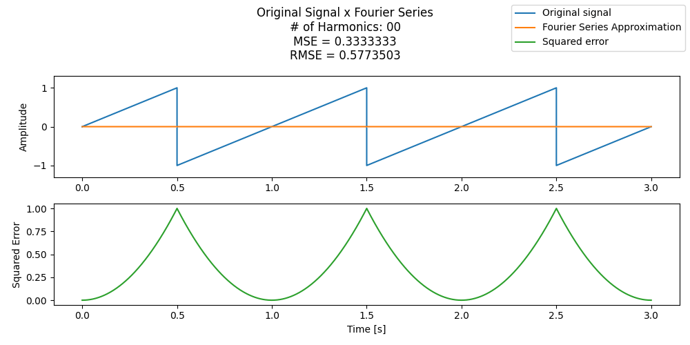

# Hi there 👋, my name is Gabriel Ribeiro
### Electronics Engineering student @ Rio de Janeiro State University (UERJ)

- 💼 I'm currently working at the **Industrial Networks and Automation Systems Laboratory (LARISA-UERJ)**

- 🔭 I’m currently working on **Machine Learning models and simulations of particle detectors**

- 🌱 I’m currently studying **High-Energy Physics and Electronics**

    <h2>💻 Languages:</h2>
    
    
    
    
    
    

<!-- 
Jupyter Notebook cell output uses a lot of storage space, so exclude language;
Exclude CMake as well.
-->

    <h2>🛠️ Softwares and tools:</h2>
    
    
    
     
    
    <h2>📫 How to reach me:</h2>
    
    
    

    <h2>🚀 Some of my hobby projects:</h2>
    <li>
        <a href="https://github.com/gabrielribcesario/CTFS" target="_blank">
            Continuous Time Fourier Series</a>
        &nbsp;
        
    </li>
    

    <li>
        <a href="https://github.com/gabrielribcesario/U-Net-Cell-Segmentation" target="_blank">
            U-Net Cell Segmentation</a>
        &nbsp;
        
    </li>
    

    <!-- <li>
        <a href="https://github.com/gabrielribcesario/MultiwireProportionalChamber" target="_blank">
            Multiwire Proportional Chamber</a>
        &nbsp;
        
    </li>
    

    <li>
        <a href="https://github.com/gabrielribcesario/ConjugateGradient" target="_blank">
            Conjugate Gradient</a>
        &nbsp;
        
    </li> -->

<!--
**gabrielribcesario/gabrielribcesario** is a ✨ _special_ ✨ repository because its `README.md` (this file) appears on your GitHub profile.

Here are some ideas to get you started:

- 👯 I’m looking to collaborate on ...
- 🤔 I’m looking for help with ...
- 📫 How to reach me: **gabrielc.ribeiro@hotmail.com**
- 😄 Pronouns: He/Him
- ⚡ Fun fact: ...
-->
